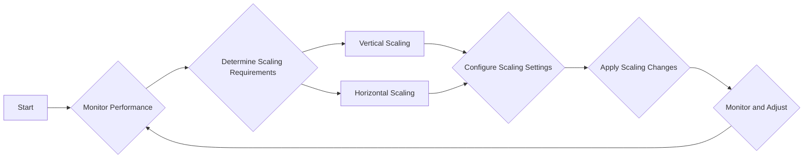

```mermaid
flowchart LR
    A[Start] --> B{Monitor Performance}
    B --> C{Determine Scaling Requirements}
    C --> D[Vertical Scaling]
    C --> E[Horizontal Scaling]
    D --> F{Configure Scaling Settings}
    E --> F
    F --> G{Apply Scaling Changes}
    G --> H{Monitor and Adjust}
    H --> B
```